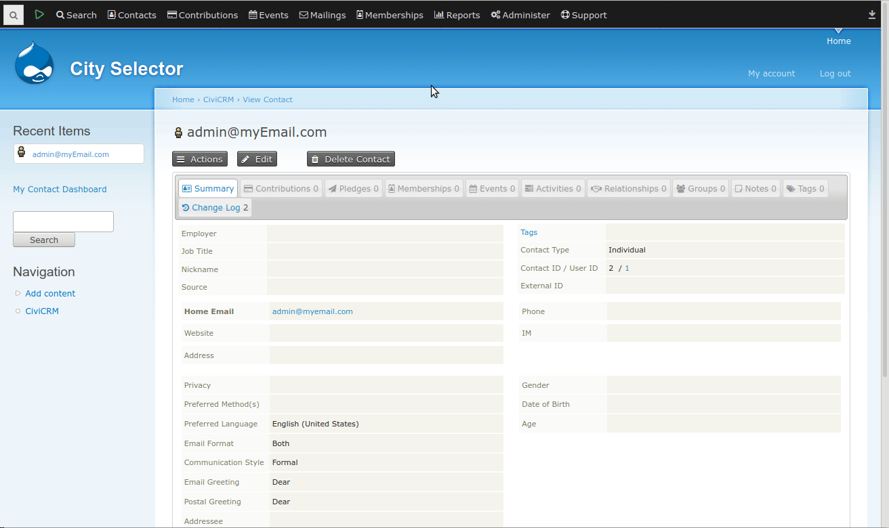

# City Selector

Replaces city textbox field as autocomplete select2, chained either to State/Province or County.  
This extension does not change the `civicrm_address`.`city` field type, it remains as classic varchar, just replaces the textbox in Contact's form as a select2 control.  

This is aimed for those Organizations that want to enter the Adresses' city field from a dropdown control, with a fixed list of options.  

Please follow the **Usage** procedures to install, configure and populate the list of cities available

--
The extension is licensed under [AGPL-3.0](LICENSE.txt).

## Requirements

* PHP v8.1+
* CiviCRM 5.69+

## Usage

1. Install the extension using your preferred method. More info on how installing extensions [here](https://docs.civicrm.org/sysadmin/en/latest/customize/extensions/).
2. After installation go to *Administer / Localization / City Selector Settings* or url `civicrm/admin/setting/cityselector?reset=1` and select which will be the parent field
of the city selector, either *State/Province* or *County* (depending on your Use Case). **IMPORTANT: This selection cannot be undone from the UI**
3. A new MySQL table will be created `civicrm_city`, where you need to populate with the list of cities you want to display with the correct `state_province_id` or `county_id`
(depending on the selection above)
4. When you create or edit a new Contact, from the main Contact Form, you'll be able to select the city from the list inserted in this table

## Caveats

- This extension does not change the MySQL structure and types of `civicrm_address`.`city` field, this means that any value can be imported in a csv file or manually edited
from the database. In case a Contact's address has a city value that is not part of any option inserted in the table, an **- Error -** option will be selected in the edition mode

## Known Issues

1. Currently works for the 1st address only.
2. Only for main Contact Edit form, pending to extend to Profiles, Search Forms and other places where the city field is shown
