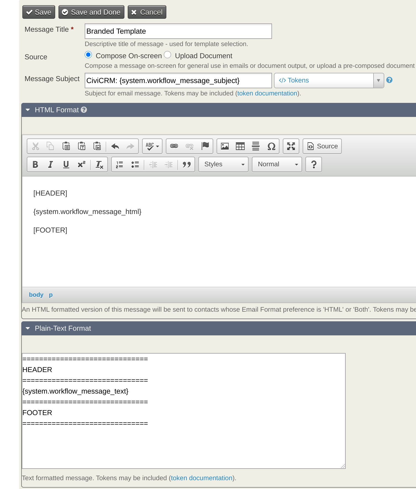
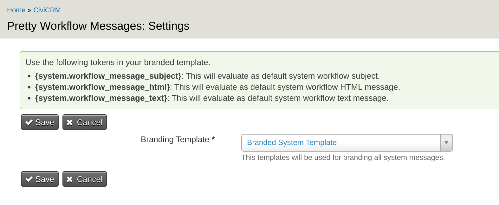

# Pretty Workflow Messages

This extension will allow users to create a single email template with organization branding and have it applied to all the system workflow templates and automated messages.

## Requirements

- PHP v7.2+
- CiviCRM v5.57.x and above

## Installation (Web UI)

Learn more about installing CiviCRM extensions in the [CiviCRM Sysadmin Guide](https://docs.civicrm.org/sysadmin/en/latest/customize/extensions/).

## Installation (CLI, Zip)

Sysadmins and developers may download the `.zip` file for this extension and
install it with the command-line tool [cv](https://github.com/civicrm/cv).

```bash
cd <extension-dir>
cv dl prettyworkflowmessages@https://lab.civicrm.org/extensions/prettyworkflowmessages/-/archive/master/prettyworkflowmessages-master.zip
```

## Installation (CLI, Git)

Sysadmins and developers may clone the [Git](https://en.wikipedia.org/wiki/Git) repo for this extension and
install it with the command-line tool [cv](https://github.com/civicrm/cv).

```bash
git clone https://lab.civicrm.org/extensions/prettyworkflowmessages.git
cv en prettyworkflowmessages
```

## Getting Started

Steps involved in extension configuration

1. Enable the extension
2. Create a new template (in Civi or Mosaico) that will include a special token and will be used for sending the emails.
3. In extension configuration "Administer >> Communications >> Pretty Workflow Messages", select the newly created template

Note: You would need [Mosaico Message Templates](https://lab.civicrm.org/extensions/mosaicomsgtpl) extension if you are using Mosaico based branding template.

### New Template



### Extension Configuration Screen



## Help

If you have any questions regarding this extension that are not answered in this README or the documentation, please post a question on [CiviCRM Stackexchange](http://civicrm.stackexchange.com). Alternatively, feel free to [contact](info@thirdsectordesign.org).

## Contributing

Contributions to this repository are very welcome. For small changes, feel free to submit a pull request. For larger changes, please create an issue first so we can talk about your ideas.

## Credits

This extension has been generously funded by our clients [Population Matters](https://populationmatters.org) and [Support Through Court](https://www.supportthroughcourt.org)

It is mantained by [Kurund Jalmi](https://twitter.com/kurund) from [Third Sector Design](https://thirdsectordesign.org/) who you can [contact](https://thirdsectordesign.org/contact) for help, support and further development.

## License

This extension is licensed under [AGPL-3.0](LICENSE.txt).
